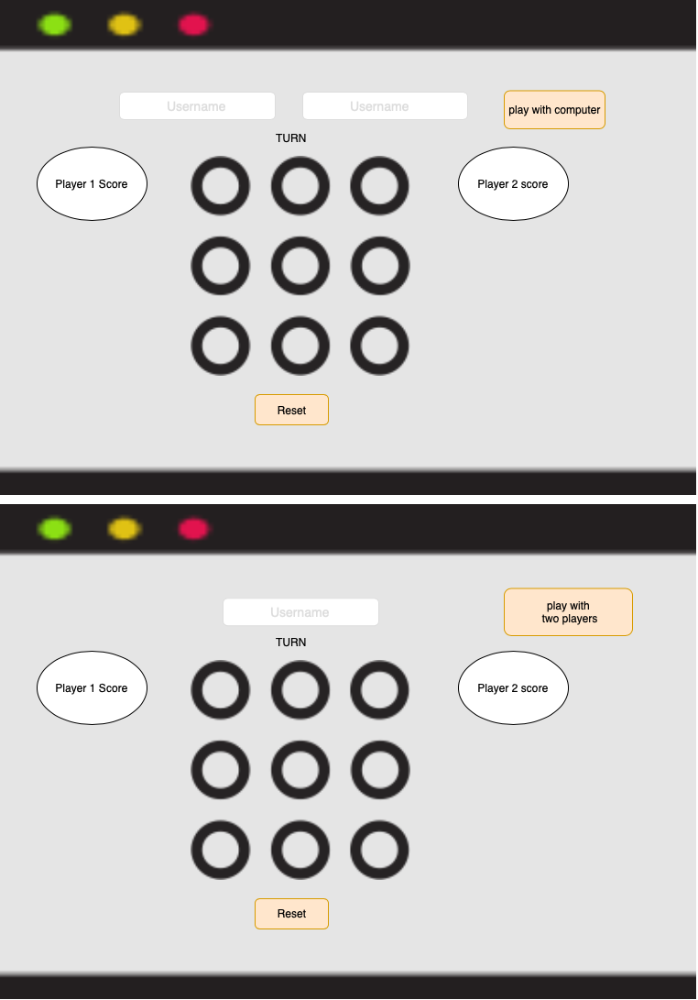

# TicTacToe

## technologies used
### Browsers:
 Google Chrome

### HTML 
### CSS
### Programming Languages
 Javascript 
 ### Libraries
 jQuery
### approach taken To do the Project:
Structured approach
 ### wireframes:
 A wireframe is a layout of a web page that demonstrates what interface elements will exist on key pages. 
 

 ### user stories :
  what is user stories :natural language description of one or more features of a software system.

  user story :
 * As a user, I should be able to start a new tic tac toe game.
* As a user, I should be able to click on a square to add X first and then O, and so on.
* As a user, I should be shown a message after each turn for if I win, lose, tie or who's turn it is next.
* As a user, I should not be able to click the same square twice.
* As a user, I should be shown a message when I win, lose or tie.
* As a user, I should not be able to continue playing once I win, lose, or tie.
* As a user, I should be able to play the game again without refreshing the page.
* As a user, I should be able to play multiple game rounds.
* As a user, I can Write my name.
* As a user, I can play from  from a mobile phone.

### how the Player win?

 ### My  favorite functions:
 when the player 