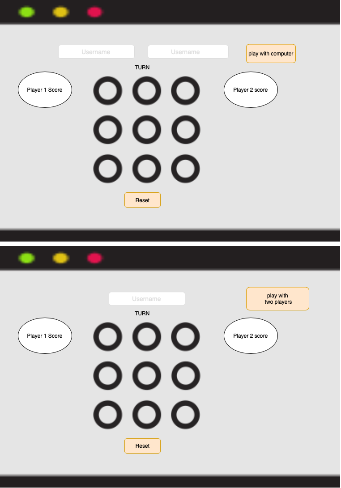
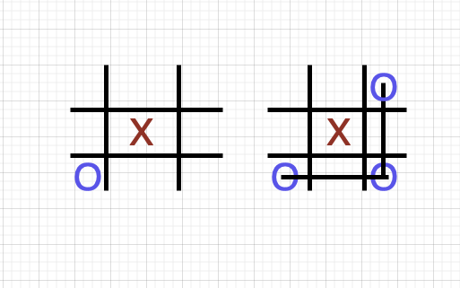

# TicTacToe
 
 Tic tac toe is a game played by two players .
 The players alternate marking X and O within the nine squares of the grid, each intending to create a row of three marks either horizontally, vertically or diagonally.
  
Goal:
The goal of this game is to be the first one who draws a row of three marks either horizontally, vertically or diagonally.

## technologies used:
### Browsers 
(Google Chrome)

### HTML 
### CSS
### Programming Languages
 (Javascript)
 ### Libraries
  * jQuery : jQuery is a fast JavaScript library. It makes things like HTML document traversal and manipulation, event handling, animation.
  
  * DOM :The Document Object Model (DOM) is a programming interface for HTML and XML documents. It represents the page so that programs can change the document structure, style, and content. 

### approach taken To do the Project:

 ### wireframes:

 A wireframe is a layout of a web page that demonstrates what interface elements will exist on key pages. 
 

 ### user stories :

  what is user stories :natural language description of one or more features of a software system.

  user story :
* As a user, I should be able to start a new tic tac toe game.
* As a user, I should be able to click on a square to add X first and then O, and so on.
* As a user, I should be shown a message after each turn for if I win, lose, tie or who's turn it is next.
* As a user, I should not be able to click the same square twice.
* As a user, I should be shown a message when I win, lose or tie.
* As a user, I should not be able to continue playing once I win, lose, or tie.
* As a user, I should be able to play the game again without refreshing the page.
* As a user, I should be able to play multiple game rounds.
* As a user, I can Write my name.
* As a user, I can play  from a mobile phone.
* As a user, I can play with AI 

## Development process:

**Planning:** start thinking how the game is work and how the players win.

**Analysis and design :**

Design wireframes and write user story

**Implement:** 
build functions and pages 
Start with html -> css -> js 

**Testing:** 
test each function as a unit.
 test all the js.file , and system testing .
And finally performance testings.
The goals of this step to find bugs and fix it.

**Maintenance :**

### how the Player win?
If he/she draws a row of three marks either horizontally, vertically or diagonally.

First check horizontally if all three Cell has same Character.
then  check vertical if all three Cell has same Character.
then  check two diagonals if all three Cell has same Character.

## strategy in AI :

how computer move: 
* First will check if there is a value  in the center cell. if No will set inside it .
if yes it will check the corners.
or will put it randomlly.

  ## what is Next ?

  Improve AI .

 

